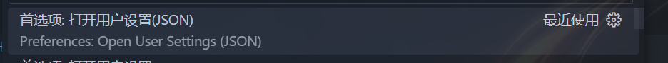
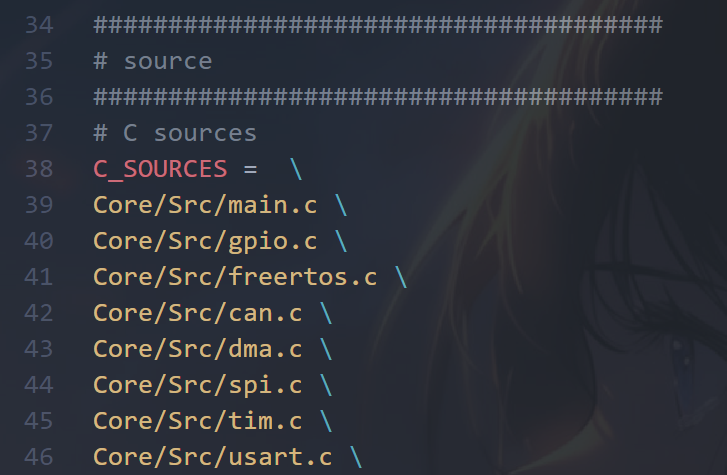

# COD_UniCFramework for VSCode

---

## 工程架构

```
COD_UniCFramework
├── 01_application   # 应用与 board 组合根
├── 02_device        # 具体设备驱动
├── 03_platform      # 厂商无关的外设/RTOS 接口
├── 04_impl          # STM32 与 FreeRTOS 后端实现
├── 05_vender        # 第三方源码，只读
└── 06_utils         # 与硬件无关的算法和服务
```

### 使用规范

依赖总体向下：`01 → 02 → 03 → 04 → 05`，`06_utils` 可被所有层使用。应用层可以直接依赖
`02_device`、`03_platform` 和 `06_utils`；`01_application/board` 是唯一允许同时组合平台与
厂商对象的位置。`02_device` 不得出现厂商类型，`03_platform` 只能通过
`04_impl/common` 的 ops + opaque context 接口绑定实现，禁止直接依赖具体后端。

`06_utils` 原则上不得向上依赖。现存的 4 条 `SEGGER_RTT`/`plat_mutex`/`plat_task` 依赖以逐条
reviewed architecture baseline 记录，任何新增依赖或已过期条目都会使质量门禁失败，不能以目录
或规则通配方式放行。

### 质量门禁

从仓库根目录运行：

```sh
./tests/run_quality.sh
python3 -B -m unittest -v tests/gates/quality/test_quality_gate.py
```

门禁检查分层、厂商中立性、生产代码误用测试头文件、仓库 `.clang-format`、float 规则，以及
FreeRTOS/SEGGER RTT 的受审校验和闭集。供应商校验和保存在
`tests/gates/quality/vendor_checksums.sha256`，会拒绝路径逃逸、重复、缺失、哈希不匹配和未列出的新增文件；
详细规则见 `tests/gates/quality/README.md`。

---

## 功能说明

### 1. bsp_can

bsp_can对can实例实现了完整的封装，只需要调用一些函数，就可以创建can实例，大大降低层级间的耦合度。

bsp_can提供两个外部接口:

```
/**
 * @brief 初始化CAN实例
 * @param config CAN初始化配置结构体指针
 * @return CAN_Instance* 创建的CAN实例指针，失败返回NULL
 * @note
 * - 首次调用时会自动启动CAN服务
 * - 自动配置过滤器
 * - 支持实例去重
 */
 CAN_Instance *initCANInstance(CAN_Init_Config_s *config);
```
`initCANInstance`用于初始化can实例，需要传入一个包含can实例配置信息的结构体，返回一个can实例指针。

```
/**
 * @brief 发送CAN消息
 * @param instance CAN实例指针
 * @return uint8_t 1:发送成功 0:发送失败
 */
uint8_t sendCANMsg(CAN_Instance *instance);
```
`sendCANMsg`用于发送can数据帧，需要传入`initCANInstance`返回的can实例指针。

### 2. bsp_buzzer

bsp_buzzer用于驱动蜂鸣器。

bsp_buzzer提供四个对外接口:

```
/**
 * @brief 启动蜂鸣器
 */
void startBuzzer(void);
```
`startBuzzer`用于启动蜂鸣器的pwm输出。

```
/**
 * @brief 停止蜂鸣器
 */
void stopBuzzer(void);
```
`stopBuzzer`用于停止蜂鸣器的pwm输出。

```
/**
 * @brief 播放指定音符
 * @param note 音符类型
 */
void playNote(Note_Type note);
```
`playNote`用于使蜂鸣器播放指定音符，需要传入音符的类型（do, re, mi, fa, so, la, si）。

```
/**
 * @brief 你愿意和我组一辈子乐队吗
 */
void ItsMyGo(void);
```
`ItsMyGo`用于警报。为什么要演奏春日影？！

### 3. motor

motor对电机实例实现了完整的封装，只需要调用一些函数，就可以控制一个电机，在app层20行代码转电机不成问题。

motor提供了4个用于控制dji电机的外部接口，5个用于控制dm电机的接口，这里只使用dm电机接口做介绍，因为封装与继承的实现，控制这两种电机的方法几乎相同。

```
/**
 * @brief  Initialize a DM motor instance.
 * @param  config  Pointer to the DM motor initialization configuration.
 * @retval Pointer to the initialized DM motor instance.
 */
DM_Motor_Instance_s *initDMMotor(DM_Motor_Init_Config_s *config);
```
`initDMMotor`用于初始化dm电机实例，需要传入一个包含dm电机配置信息的结构体，返回一个dm电机实例指针。

```
/**
 * @brief  Set the reference value for the DM motor.
 * @param  motor Pointer to the DM motor instance.
 * @param  ref   The reference value to set.
 * @retval None.
 */
void setDMMotorRef(DM_Motor_Instance_s *motor, float ref);
```
`setDMMotorRef`用于设定dm电机的期望值，需要传入`initDMMotor`返回的dm电机实例指针与期望值。

```
/**
 * @brief  Change the feedback type for the DM motor.
 * @param  motor     Pointer to the DM motor instance.
 * @param  loop      The closed-loop type (VELOCITY_LOOP or ANGLE_LOOP).
 * @param  feedback  The feedback type to set.
 * @retval None.
 */
void changeDMMotorFeedback(DM_Motor_Instance_s *motor, Motor_ClosedLoop_Type_e loop, Motor_Controller_Measure_e feedback);
```
`changeDMMotorFeedback`用于修改dm电机闭环控制中反馈值的源（也就是pid的measure），需要传入`initDMMotor`返回的dm电机实例指针、闭环的类型（是哪个环需要修改measure）、控制器反馈源的类型（编码器，IMU，等等）。

```
/**
 * @brief  Set the mode for the DM motor.
 * @param  motor Pointer to the DM motor instance.
 * @param  mode  The mode to set.
 * @retval None.
 */
void setDMMotorMode(DM_Motor_Instance_s *motor, DM_Motor_Mode_e mode);
```
`setDMMotorMode`用于设定dm电机模式，需要传入`initDMMotor`返回的dm电机实例指针，以及dm电机模式的类型（传入DM_START就可以转电机了）。

```
/**
 * @brief  Control the DM motor based on the given parameters.
 * @retval None.
 */
void controlDMMotor(void);
```
`controlDMMotor`用于计算电机的pid控制器输出，以及发送can数据帧，只需要在task中调用即可。

---

## 环境配置

### 0. 重要的说明

这个模板是因为我实在受不了Keil礦ision5的远古UI而诞生的。但不可否认的是，**Keil的dubug功能仍是目前最稳定，最强大的。** 不过在代码编辑的体验上，VSCode能将Keil秒成渣。使用这套模板，你会得到现代化的UI、可定义的外观、有代码高亮的编辑器、智能的代码提示、以及更快的gcc编译器。在cortex-debug插件的加持下，你也可以进行一些简单的调试。

### 1. 配置环境

工具链下载：
[下载链接](https://git.lug.ustc.edu.cn/yssickjgd/robowalker_train)

注意，我们只需要看视频的前半段将编译环境配置好即可，不需要下载CLion，我们是要用VSCode的。

如何配置请参考中科大的环境配置教学视频：
[视频链接](https://www.bilibili.com/video/BV1Rx4y1C7d4/?share_source=copy_web&vd_source=bdc55be0ac01633d897f11bbe4a17bc5)

### 2. 下载必要的插件

1. `C/C++` （用于 C/C++ 智能提示、调试和代码浏览）
2. `Cortex-Debug` （ARM Cortex-M GDB 调试器）
3. `Cortex-Debug: Device Support Pack - STM32F4` （F4 芯片调试支持包）
4. `Makefile Tools` （用于编译、调试、运行 C/C++ 程序）
5. `PowerShell` （命令行）
6. `Task Buttons`（将 keil 中的编译，重编译，以及下载功能以图标的形式显示在左下角的状态栏）

   注意，此插件的作者为 *spencerwmiles*，下载其他作者的插件可能会导致配置文件不可用。

### 3. 一些不必要但会极大提高效率的插件

1. `IntelliCode`

   从 GitHub 上高星的开源项目经过大量的机器学习训练，给开发者提供最合适的 IntelliSense 上下文建议功能，除此之外，还有代码格式化和规则推测等功能。
   
2. `Error Lens`

   将编译器的报错信息显示在代码右侧。

想下载更多有意思的插件可以在 B 站，CSDN 等网站上搜索“VSCode 插件”、“嵌入式”等关键词。

### 4. 此模板的使用方法

1. 目前，你应该已经跟着中科大的教程下载好了工具链，也配置好了环境变量。你接下来需要打开VSCode，按快捷键 `Ctrl + Shift + P` ，在上方弹出的搜索栏中输入 `settings` ,在下拉列表中找到并打开下图所示的选项。


2. 现在你应该进入了settings.json的编辑界面，你需要将下文的json代码更改后填到空白的区域。

```json
"makefile.configureOnOpen": true,	// 这行以及下一行代码直接cv即可，不需要更改
"makefile.makePath": "mingw32-make",

"cortex-debug.armToolchainPath": "D:\\MCU\\VSCodeToolChain\\gcc-arm-none-eabi-10.3-2021.10\\bin",	// 这行是设置编译链的路径，你需要将它改为你自己的路径，以bin文件夹作为结尾
"cortex-debug.openocdPath": "D:\\MCU\\VSCodeToolChain\\OpenOCD-20231002-0.12.0\\bin\\openocd.exe",	// 这行是openocd的路径，你需要将它改为你自己的路径，以openocd.exe作为结尾
"cortex-debug.gdbPath": "D:\\MCU\\VSCodeToolChain\\gcc-arm-none-eabi-10.3-2021.10\\bin\\arm-none-eabi-gdb.exe",	// 这行是gdb的路径，你需要将它改为你自己的路径，以arm-none-eabi-gdb.exe作为结尾 
```

3. 进行到这一步，环境就算彻底配置好了。在日后使用中你一定会在模板里新增 `.c` 文件，这时请打开根目录下的 `makefile` 文件，在 `C_SOURCES` 下将你新增的 `.c` 文件路径填写进去。填写格式可参考 `C_SOURCES` 中已填写好的路径。为了防止你可能找不到 `C_SOURCES` 的位置，我放了张图片供大家参考。


#### 需要设置的环境变量：`ARM_TOOLCHAIN_BIN`

`.vscode/settings.json` 里 clangd 的 `--query-driver` 指向工具链的 `bin` 目录。这个路径因人而异，所以写成了 `${env:ARM_TOOLCHAIN_BIN}` 而不是某台机器的绝对路径 —— 你需要把这个变量设成自己工具链的 `bin` 目录，也就是 `arm-none-eabi-gcc` 所在的那个目录。

Linux / macOS，加进 `~/.bashrc` 或 `~/.zshrc`：

```sh
export ARM_TOOLCHAIN_BIN=/path/to/arm-gnu-toolchain-.../bin
```

Windows 则在系统环境变量里新建同名变量。设置完要**重启 VSCode**（而不只是重新加载窗口），因为它只在启动时读取进程环境。

**没设置会怎样**：clangd 不会报错，而是把所有交叉编译的头文件当成找不到，于是编辑器里满屏红波浪线，但 `./build.sh` 照样编译通过。所以看到"能编译但 IDE 报错"时，先查这个变量。

#### 注意事项
请不要随意修改模板根目录下 `.vscode` 文件夹中的配置文件。这么做可能会导致此模板的某些功能不可用。如果你对这些配置很了解，请忽略这个注意事项。

上面第 3 条提到的 `makefile` 已经不存在了 —— 构建已改为 CMake，新增 `.c` 文件要加到根 `CMakeLists.txt` 的 `target_sources` 里，详见 `CLAUDE.md`。

---

## 致谢

此模板基于**严远斌**学长的`HAL-Template`，裁判系统、IMU等模块来源于**王芃**学长。大部分vscode的配置文件以及bsp_can，motor模块的编写参考来源于湖南大学跃鹿战队的 `basic_framework`，环境配置教程来源于中科大。
在此十分感谢以上的个人、战队、院校。
